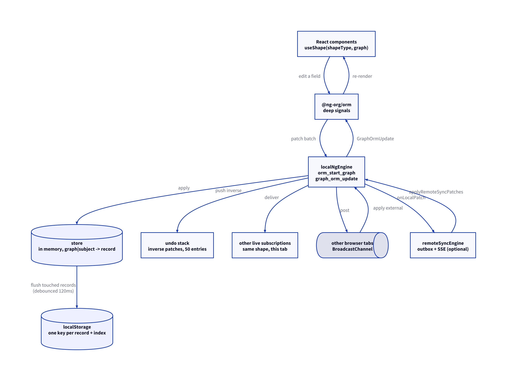
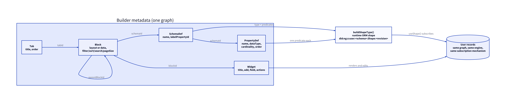
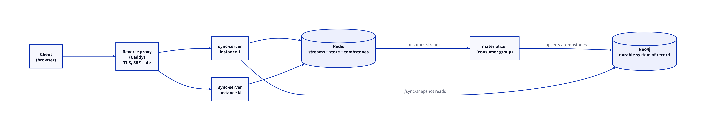
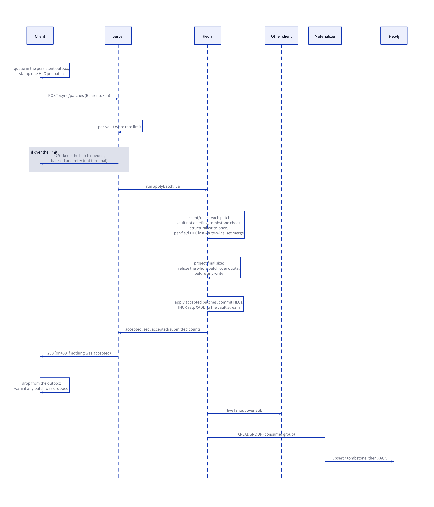

# Architecture

How the application actually works today, end to end. Read this first; the
other documents go deeper on one part each.

The project is two things stacked, and they are worth keeping separate in your
head:

1. **A browser-local record-app builder.** Schemas, fields, tabs, layout
   blocks, data blocks and widgets are defined in a Settings UI and stored as
   graph data in `localStorage`. That graph drives the rendering, so the
   builder's own configuration and the user's records live in one store,
   reachable through one subscription mechanism. No account, no server, no
   network surface at all.
2. **An optional sync tier.** Pairing a *vault* with one checksummed `LG1`
   code replicates that same graph across devices: HTTP POST up, Server-Sent
   Events down, Redis for sequencing and fanout, Neo4j as the durable system
   of record. The client decodes the code to the server's unchanged vault id
   and bearer token.

The property that falls out of (1) — and the one thing here that is genuinely
unusual — is that because builder metadata is stored like any other record, it
syncs like any other record. Build a screen on a laptop and it appears on the
phone. Nothing special-cases that; it is a consequence of the storage model.

Everything below describes the system **as built**. For why particular sync
decisions were made (and what was rejected), see
[`remote-sync-architecture.md`](remote-sync-architecture.md); for the sync
tier's operational surface, see [`remote-sync.md`](remote-sync.md).

---

## 1. The browser application

### 1.1 The seam: two functions

`@ng-org/orm` drives React through `useShape(shapeType, graph)`, which returns
a live, mutable set of deep-signal objects. To do that it needs an engine, and
it needs exactly two things from one:

| Function | Direction | Meaning |
| --- | --- | --- |
| `orm_start_graph(graphs, subjects, shapeType, session, callback)` | engine → app | Subscribe to every stored object matching a shape and scope. Delivers an initial payload, then patch batches. |
| `graph_orm_update(subscriptionId, patches, session)` | app → engine | A signal object was mutated; here are the resulting patches. |

The real NextGraph engine implements those over a wasm CRDT store talking to a
broker that requires a hosted wallet. `src/utils/localNgEngine.ts` implements
the same two functions over `localStorage` and a `BroadcastChannel`. That is
the whole substitution — no wallet, no broker, no network.

It is also why the sync tier could be bolted on without rewriting the app:
sync hooks into this same seam through two additional exports
(`onLocalPatch`, `applyRemoteSyncPatches`) rather than into the components.



### 1.2 Records, keys and patches

A record is a plain JSON object carrying two reserved fields:

```jsonc
{
  "@id": "did:ng:z:meta:schema:2f1c…",   // the record's own subject id
  "@graph": "did:ng:9b31…",              // which graph it belongs to
  "@type": "did:ng:z:SchemaDef",
  "name": "Books"
}
```

The in-memory `store` is keyed by `` `${graph}|${id}` `` — the *graph-qualified*
key, not the bare `@id`. This distinction is load-bearing and has bitten this
codebase before: the first segment of a patch path is the qualified key, while
`@id` is the unqualified id, and the two differ for every record the app itself
generates. Keying anything by the wrong one produces silent duplicates rather
than an error (see [`build-history.md`](build-history.md), step 3).

Patches are JSON-Pointer-ish:

```jsonc
{ "op": "add",    "path": "/did:ng:9b31…|did:ng:z:meta:schema:2f1c…/name", "value": "Books" }
{ "op": "remove", "path": "/did:ng:9b31…|did:ng:z:meta:schema:2f1c…" }
{ "op": "add",    "path": "/…/tags", "value": ["a"], "type": "set", "valType": "set" }
```

Path segments are RFC 6901 escaped (`~1` → `/`, `~0` → `~`). A patch with one
path segment addresses the whole record; two segments address one property.
`type: "set"` (or the older `valType: "set"`) means *merge this member into the
array*, not *replace the array* — which is what makes multi-value fields
commutative, and therefore safe to apply in any order.

The same patch algebra is implemented three times, deliberately kept in step:
`applyPatchesToStore` in `src/utils/localNgEngine.ts` (browser),
`applyPatchesToStore` in `server/src/patchApply.ts` (materializer), and the
apply loop in `server/src/redis/applyBatch.lua` (accept-time). If you change
one, change all three.

### 1.3 Persistence

Storage is one `localStorage` key per record, plus a small index:

```
meta-ui-builder:ng-local-store:record:<graph>|<id>   → the record's JSON
meta-ui-builder:ng-local-store:index                 → JSON array of known keys
meta-ui-builder:ng-local-store                       → legacy single-blob key (migration source only)
```

Writes are **incremental**: `applyPatchesToStore` records every touched key in
a `dirtyIds` set, and a flush re-serializes only those records. Editing one
field in a 300-record store performs one `setItem`, not a rewrite of the store.

A flush is debounced 120 ms, and forced on `pagehide` and on
`visibilitychange` → hidden, so closing a tab mid-typing does not lose the last
keystrokes.

`persistNow()` runs in two passes: pass one computes every write and the
projected total size without touching `localStorage`; pass two commits. That
keeps the size cap all-or-nothing — if the projected total would exceed
`RUNTIME_LIMITS.storedBytes` (4 MB), nothing is written at all and persistence
is disabled for the page rather than half-applied.

Migration from the old single-blob layout is write-before-delete: every record
and the index are written under the new scheme and verified byte-for-byte
against what was just written, and only then is the old blob removed. A failure
partway through leaves the old blob authoritative and retries on the next load.

A single corrupted record is reported and skipped; it no longer costs the whole
store, which the blob layout could not manage.

### 1.4 Cross-tab replication

Every applied patch batch is posted to a `BroadcastChannel`, together with
bounded snapshots of the records it touched. The snapshots exist for a specific
race: a tab that missed the original *creation* message would otherwise apply a
later field edit to a record it has never seen. Given the snapshot it can
reconstruct the record's identity first.

Received batches are validated (batch size, path length, record shape, total
byte budget) and then applied exactly like a local edit — same store mutation,
same subscription delivery — but not re-posted, since `BroadcastChannel`
already fanned the message out to every other tab.

Record creation is insert-only (`omitDuplicateCreations`): adding an object
whose graph and subject already exist never overwrites the existing one. This
is what stops a late bootstrap in one tab from clobbering edits made in
another.

### 1.5 Subscriptions and shape revisions

A subscription is a graph scope, an optional subject list, and a shape. On
open, the engine scans the in-memory store for matching records (matching means
graph, subject and RDF type all match) and delivers them as an initial payload.
After that it receives patch batches.

Delivery is filtered two ways. By **scope**, so a subscription only hears about
records inside its graph; and by **shape**, so an update to one shape's objects
is never applied to an unrelated shape's signal set.

The initial payload is delivered on a double `requestAnimationFrame` rather
than a microtask. `useShape` subscribes from a passive effect that React
schedules on a `MessageChannel` task; delivering earlier can land before the
subscription exists, leaving a component permanently showing empty data with no
further signal to re-render. A double rAF reliably lands after React's effect
flush and before the next paint.

**Shape revisions.** `buildShapeType()` derives the runtime shape IRI from a
deterministic FNV-1a hash of the schema's property list:

```
did:ng:z:user:<schemaId>:Shape:<revision>
```

The RDF *type* stays stable, so existing records keep loading, but the shape
IRI changes whenever fields or enum options change. That forces the ORM's
subscription pool to reopen rather than reuse a stale subscription under the
same IRI.

The cost is that adding a field briefly leaves **two live subscriptions over
the same records** — the ORM tears the old shape's signal down well after the
replacement opens. Both observe the same mutable record branches, so each sees
the other's write and reports it as a fresh local edit. Left alone that
rebroadcast never settles and the tab locks up. `graph_orm_update` therefore
drops any batch whose net effect the engine has already recorded
(`batchIsInert`), which ends the exchange after one hop.

That check compares against `undoSnapshotStore`, a shadow copy that only moves
when the engine itself applies a patch — **not** against `store`. ORM signal
objects share `store`'s record branches, so by the time an edit is reported
`store` already contains it and every genuine write would look inert.

### 1.6 Undo

The engine keeps a bounded stack (50 entries) of **inverse** patch batches,
computed against `undoSnapshotStore` before the forward batch is applied.
Undoing pops one entry and applies it as an ordinary edit: it persists, it
reaches other tabs, and it syncs, exactly like anything else. There is no
separate rollback path and no cross-device history.

One entry is one editing gesture, not one keystroke. A run of writes to the
same scalar property coalesces into the entry already on the stack while the
run continues; the entry restores the value from before the run began, which is
what undoing an edit means. A run ends on a 1.2 s pause, on moving to another
property, or on an undo. Multi-value (set) fields are excluded from coalescing:
each checkbox is a deliberate act, unlike the letters of a word.

Two details that are easy to get wrong:

- The automatic creation of the Home tab and the Settings singleton is filtered
  out, so the first undo after a fresh load is not "delete your Home tab".
- Undo re-broadcasts to subscriptions, which then echo the change back as if it
  were a local edit. `expectedUndoEchoes` recognises and drops that echo by
  signature within a one-second window.

The stack lives in the page session. Reloading starts empty, deliberately.

### 1.7 Runtime safety

`src/utils/runtimeHealth.ts` holds the limits and the visible issue banner:

| Limit | Value | Guards |
| --- | --- | --- |
| `storedBytes` | 4,000,000 | Total persisted size; loading or flushing beyond it stops rather than corrupting |
| `patchBatch` | 5,000 | Patches accepted in one batch from any source |
| `graphNodes` | 10,000 | Records in an imported backup or a reconciled snapshot; block-graph traversal |
| `blockDepth` | 32 | Recursive block nesting |

Recoverable problems surface in an on-screen banner with a reload and a dismiss
control. Render failures hit an error boundary that shows a reload screen
instead of leaving an unresponsive page. Cyclic or over-deep block graphs are
cut off inline with a notice rather than being allowed to recurse.

Issues are keyed by severity, context and message, so a repeating fault
increments a counter instead of flooding the banner.

### 1.8 Offline shell

Production builds ship a web manifest and a service worker (`public/sw.js`).
The worker caches the app shell and its assets on install, serves navigations
network-first with a cache fallback, and serves assets cache-first with a
background refresh. After one online load the app cold-starts fully offline
with its local records.

`/sync/*` is never intercepted, cached or replayed by the worker — a stale
cached sync response would be considerably worse than a failed request, since
the client's outbox already handles the failure correctly.

### 1.9 The theme, and why it is a stylesheet

`src/styles/global.css` defines 228 CSS custom properties. Nineteen colour
*roles* — background, surface, border, text, accent, danger, headings, labels
and so on — may be overridden from the graph, each with a separate light and dark value,
stored as ordinary optional fields on the Settings record. Absent means "use
the stylesheet default", so an unthemed graph renders exactly as before and no
migration was needed.

Two decisions carry the weight.

**It generates a stylesheet, not inline properties.** `applyThemeToDocument`
writes one `<style id="graph-theme">` element containing a `:root` block and a
real `@media (prefers-color-scheme: dark)` block. The obvious alternative —
`documentElement.style.setProperty` — is wrong in a way that is hard to
notice: an inline property beats a media query, so both palettes would collapse
into whichever was written last, and a themed app would stop following the
system colour scheme. Generating CSS removes the possibility instead of
documenting it.

**Stored values are validated against a closed grammar.** A theme arrives
through JSON import and through a vault whose token another person may hold, so
a value is a string someone else may have chosen. `validThemeColor` accepts
only three hex forms and four functional notations with numeric arguments, and
rejects outright anything containing `url(`, `image-set(`, a backslash, a
comment sequence, `;` or `}`. A failing value is dropped rather than corrected,
so it behaves identically to an absent one. This is the same discipline
`sanitizeLabel` applies before splicing a label into Cypher: nothing reaches a
language from stored data without matching an allowlist first.

**A minimum contrast floor, applied at generation time.** A colour that would
leave text lost against its background is moved apart before it reaches the
stylesheet, so a choice cannot make the app unreadable while it is being made.
The floor is 2.5:1 and is deliberately below the built-in `text-subtle`, which
sits at 2.69:1 — anything stricter would rewrite the shipped palette on first
load, and a test asserts every default clears its own gate. The foreground
moves first, because a background is read against several foregrounds while a
foreground is read against one; a value already at 00 or ff cannot be pushed
further without inverting it into something plainly unchosen, so there the
background gives way instead and the choice survives exactly. Corrections are
computed against every background a colour is read on at once, not one at a
time — the latter lets the second correction undo the first, which a sweep test
caught settling at 2.4930 against a floor of 2.5.

Backing that up, the app ships a Content Security Policy — as a build-injected
`<meta>` tag and as a response header from `staticServer.ts`. `font-src 'self'`
is the load-bearing directive: it makes "a stored value cannot cause an
outbound request" a guarantee the browser enforces rather than a convention
every future change must remember. The policy is injected at build time only,
because `@vitejs/plugin-react` serves its dev refresh preamble as an inline
module script that `script-src 'self'` would block, and weakening the shipped
policy for a dev-only script would defeat the point.

The stored theme also drives the installed window chrome. `index.html` ships a
static `theme-color` so an installed app has a colour before any script runs,
and `applyThemeToDocument` inserts two media-qualified tags ahead of it — the
browser uses the first tag whose media matches, so the static one remains the
pre-script fallback. They carry the accent role, which is what the static tag
already held, so an unthemed app is unchanged.

Fonts are the system stack, and there is no font setting at all. Vendored
open-licensed families were planned and then declined: they would add bundle
weight and a precache list to maintain, to support a preference that changes
nothing about whether the app works. Webfont URLs in the graph are refused for
the reason above, and font bytes in the graph fall under the existing file and
image deferral — see [`roadmap.md`](roadmap.md).

---

## 2. The builder metadata model



Five metadata types, all ordinary records in the same graph:

| Type | What it is |
| --- | --- |
| `Tab` | A navigation destination. `Home` has a fixed well-known id and is always first. |
| `Block` | Either a layout container (stack / row / grid, nestable via `parentBlockId`) or a data block bound to a schema. |
| `Widget` | Rendering and editing configuration belonging to a data block: panel title, add button, one per field, edit/delete actions. |
| `SchemaDef` | A user-defined record type, optionally naming the property used as its records' display label. |
| `PropertyDef` | One ordered field of a schema: data type, cardinality, enum options, reference target. |

Their shapes are declared in `src/shapes/shex/metaShapes.shex` and compiled to
TypeScript by `pnpm build:orm`; the generated artifacts in `src/shapes/orm/`
are committed.

**From schema to screen.** `buildShapeType(schemaDef, properties)` turns a
schema and its fields into a runtime ORM shape: an RDF type predicate pinned to
`did:ng:z:user:<schemaId>`, plus one predicate per property. Property IRIs
include the schema subject, so two schemas with an identically named field
never share a predicate. Cardinality maps to min/max counts; enum options
become literal-constrained data types.

**Record labels.** A schema can select one text or enum property as its
`labelPropertyId`. When omitted, the first eligible property by schema order is
used, preserving existing schemas without migration. `lookupRecordLabel()`
resolves the target record, schema, and selected property directly from the
already-resident local store; the legacy automatic lookup is cached per schema.
This display layer never changes the stable `did:ng:…` value stored in a
reference.

**Tab URLs.** User-tab links derive a normalized slug from the display title
at render time; no slug is stored or synced. The first tab by order owns a
colliding slug and later collisions fall back to their stable `@id`. Route
resolution checks raw ids first, so existing bookmarks remain valid even when
a tab is renamed or reordered. Those changes can alter the preferred slug,
but never the permanent raw-id route.

`BlockRenderer` then walks the block tree for a tab. A data block resolves its
schema and properties, calls `useShape` with the derived shape, and applies the
reader pipeline in one memo: configured filter, reader search across displayed
fields only, sort, then pagination. Search and page size are per-block settings
aimed at whoever is *reading* the tab; a search query lives only in the open
page and is neither stored nor synced.

Each data block also offers export and print, both acting on the whole filtered
result rather than the page on screen. Export writes every stored property, not
only the displayed ones, and represents identities and references with both
`@label` and the stable `@id`. Print mounts a plain black-and-white sheet outside
the app shell so the print stylesheet can hide the interface entirely.

---

## 3. The optional sync tier

Unpaired, none of this exists — there is no network code on any path. Pairing a
vault switches the app's active graph from its randomly generated local one
(`did:ng:<private_store_id>`) to the vault's (`did:ng:<vaultId>`), and starts
the sync engine.

Pairing does **not** migrate the previous unpaired graph. Export a backup
first, import it after.

The Settings UI represents the vault UUID and 24-byte bearer token as one
versioned Crockford-base32 pairing code. Its trailing mod-37 symbol catches
single-character substitutions and adjacent transpositions before any network
request. Decoding is case-insensitive and accepts Crockford's `0/O` and
`1/I/L` aliases. This is the only credential form the interface offers — the
vault id and token are never displayed or entered separately — while the HTTP
API and the stored sync configuration keep them as two fields. The same code is rendered as an in-app QR with no third-party
service or runtime dependency. Camera scanning uses the browser's
`BarcodeDetector` only where it is available in a secure context; plain-HTTP
LAN clients retain the manual field and receive an explanation instead.
For devices that are elsewhere, an authenticated device can issue a checked
`PAIR-XXXX-XXXX-X` exchange code. It expires after ten minutes, redeems once,
and is bound to the current token generation; the same join field accepts it
and receives the durable credentials from the server.



### 3.1 The client engine

`src/utils/remoteSyncEngine.ts` subscribes to `onLocalPatch` and does four
things:

- **Outbox.** Every local batch is appended to a `localStorage` queue with a
  fresh `batchId` (UUID) and one HLC. The queue survives reloads and drains in
  order with exponential backoff up to 30 s. Nothing is dropped until the
  server has answered.
- **HLC.** `<15-digit ms>-<6-digit counter>-<nodeId>`, fixed width so a plain
  string comparison sorts it. The counter advances when two batches land in the
  same millisecond; the node id breaks remaining ties.
- **Live stream.** `EventSource` cannot set headers, so the client exchanges
  its bearer token for a short-lived stream-only ticket and connects with
  `?since=<cursor>&ticket=…`. The durable vault token therefore never appears
  in a proxy access log.
- **Cursor.** The last applied `seq`, persisted per vault.

Incoming entries are ignored if they came from this node or from a `batchId`
already in a 512-entry applied ring, then applied through
`applyRemoteSyncPatches` — which also relays them to other tabs, since only one
tab holds the `EventSource`.

A dropped connection is not reported immediately: `EventSource` retries
natively and edits keep queuing, so a banner only appears if the connection has
not recovered within 15 s, and clears the moment it does.

### 3.2 The write path



`POST /sync/patches` runs `server/src/redis/applyBatch.lua`, which makes the
accept decision, applies the accepted patches, assigns the sequence number and
appends to the vault's stream — **all inside one Lua script**, so the decision
and the sequencing stay correct under concurrent writes from any number of
stateless server processes. A 500-write concurrent burst produced unique,
gapless sequence numbers.

The accept rules, in the order the script applies them:

1. **Batch idempotency.** A `batchId` seen within 24 h returns its original
   result without reapplying.
2. **Tombstone check.** If the subject has a tombstone whose HLC the batch does
   not strictly exceed, the patch is rejected — a node that was offline across
   a deletion cannot resurrect the record. A genuinely newer write to the same
   subject proceeds and clears the tombstone.
3. **Set patches** are always taken; they merge commutatively.
4. **Structural creation** (`@id`, `@graph`, `@type`, or the root add) is
   write-once. Two offline nodes creating the same well-known record converge
   on one, rather than one overwriting the other.
5. **Everything else** is per-field last-write-wins on the HLC.
6. **Vault quota.** The script applies accepted patches to an in-memory
   projection, measures the exact serialized record bytes, and refuses the
   entire batch if it would grow the vault past `VAULT_QUOTA_BYTES` (8 MiB by
   default). Only after that check does it commit records and field HLCs.

One subtlety in rule 5 that took a real bug to find: every patch in a batch
carries the batch's single HLC, so a strict `prevHlc < hlc` test makes the
second patch for a field lose against its own batch. An undo submits exactly
that shape — remove the field, then add the previous value back — and arrived
at the vault as a bare deletion. The script therefore tracks the fields a batch
has already claimed and lets a later patch for the same field through; within a
batch the last patch wins, matching how the same list applies locally.

The response carries accepted and submitted counts. A partially accepted batch
is a 200 with a reason; a wholly rejected one is a 409. Either way the client
stops retrying — under last-write-wins a rejection is terminal, and the winning
value arrives over SSE — but raises a visible warning naming the dropped count
and the reason. A quota refusal is likewise terminal and all-or-nothing; no
patch, HLC, sequence, stream entry or dedupe record from that batch is retained.
Before entering the Lua transaction, each authenticated, structurally valid
batch increments `vault:<id>:wrate`. Past the default 600-per-60-second limit,
the server returns 429 without attempting the write. Unlike a terminal 409, the
client keeps that batch at the head of its durable outbox and retries with
exponential backoff until a later attempt is accepted.

### 3.3 Redis's role

Redis is the ingest and fanout tier, not the durable store. Per vault:

| Key | Contents |
| --- | --- |
| `vault:<id>:meta` | Token hash plus created, rotated, last-active, and deletion-in-progress timestamps |
| `vault:<id>:seq` | Monotonic sequence counter |
| `vault:<id>:store` | Materialized current record per subject |
| `vault:<id>:bytes` | Exact serialized bytes in `store`, atomically maintained for quota enforcement |
| `vault:<id>:wrate` | Fixed-window authenticated batch counter, short TTL |
| `vault:<id>:hlc` | Per-field last-write HLC |
| `vault:<id>:stream` | The ordered accepted-patch log, trimmed to ~5,000 entries |
| `vault:<id>:tombstones` | Deleted subject → deletion HLC |
| `vault:<id>:batch:<batchId>` | Idempotency record, 24 h TTL |
| `vault:<id>:stream-ticket:<hash>` | Stream ticket → token generation, 1 h TTL |

Plus three keys outside the per-vault namespace: `vaults:index`, the set the
materializer uses to discover vaults without scanning the keyspace;
`vault:pair-code:<hash>`, a one-use pairing code carrying its own vault id and
token generation, with a ten-minute TTL; and `materializer:shard:<index>`, the
ownership lease a materializer process claims and heartbeats. The pairing key
sits outside `vault:<id>:*` deliberately — it is looked up by code, not by
vault — so deleting a vault leaves any outstanding code behind to expire
harmlessly, since redemption revalidates against the vault's now-absent meta
hash.

Live fanout works because each server process tails a vault's stream on a
dedicated blocking connection and pushes entries to its locally attached SSE
listeners. That is what lets *any* instance serve *any* vault's stream
regardless of which instance accepted the write. Listeners do their historical
catch-up both before and after attaching, closing the handoff race; duplicate
delivery is harmless because the client dedupes by `batchId`.
Successful vault deletion publishes a Redis lifecycle notification so every
server replica ends any attached SSE responses; their reconnect then receives
404. Deletion removes index membership and every `vault:<id>:*` key as well as
the durable Neo4j identity, records, and tombstones.

Redis must run with AOF (`appendonly yes`, `appendfsync everysec`). Without it,
a hard kill can lose already-accepted writes *and* a vault's identity — this
was found the hard way and is documented in
[`build-history.md`](build-history.md).

### 3.4 The materializer and Neo4j

A separate process (`ROLE=materializer`, same build artifact) consumes each
vault's stream through a Redis Streams consumer group and replays it into
Neo4j. One process owns every vault by default. At higher volume, processes
take explicit indexes within a common shard count and own vault V when
`fnv1a(V) % shardCount === shardIndex`.

One blocking `XREADGROUP` carries up to 64 vault streams rather than opening a
connection per vault. The limit is configurable with
`MATERIALIZER_STREAMS_PER_CONNECTION`. Discovery fills an existing batch
before opening another connection, and a newly added stream drains this stable
consumer's pending entries before joining the live read. Rows returned for a
batch are applied sequentially: this bounds Redis connections but means a slow
Neo4j write can delay other vaults in the same batch. A smaller configured
batch trades more connections for less head-of-line coupling.

The consumer name is `materializer-<shardIndex>`, stable across restarts and
distinct between shards rather than process-id-based. That matters
because a consumer group only redelivers a crashed consumer's pending entries
to a later read *under the same consumer name*; a name that changed per restart
would silently orphan whatever was in flight. On start it drains its own
unacknowledged entries before joining the live tail. A process also holds the
short-lived Redis key `materializer:shard:<index>` and heartbeats it. A
duplicate index fails startup loudly; loss of an acquired lease stops that
materializer so it fails closed instead of continuing as a second owner.

Neo4j holds one `:Record` node per `(graph, subjectId)`, where `graph` is the
vault id. Its type label comes from a closed set: `Type_Tab`, `Type_Block`,
`Type_Widget`, `Type_SchemaDef`, `Type_PropertyDef`, `Type_Settings`, or
`Type_User` for every other type. The exact IRI stays in `r.type`; this property,
not the label, backs type queries and the `(graph, type)` index. Cypher cannot
parameterize labels, so even these application-owned names pass through the
`[A-Za-z0-9_]` whitelist before interpolation; never splice unchecked text into
a query. The record's own `@id`/`@graph` are stored separately as
`recordId`/`recordGraph` so they round-trip even when they differ from the
lookup identity. Upserts use `SET r = $props` (full replace, not `+=`) so a
removed property actually disappears. A deletion keeps the node and adds
`:Deleted` plus `deletedAtHlc`; a missing node cannot be distinguished from one
that never existed, which retention purging needs.

Vault identity is mirrored here too (`:VaultMeta`, token hash only, never the
plaintext). If Redis loses a vault's metadata, the next authenticated request
reconstructs the Redis entry and the vault index from Neo4j before serving.
Legacy deployments may retain harmless per-schema labels on existing nodes;
the optional dry-run-first cleanup is documented in the deployment guide.

Tombstones are purged from both stores after 30 days by a sweep on the
materializer. Neo4j decides what has expired and Redis mirrors the decision, so
the two cannot disagree. The same sweep reports vaults idle past the configured
window (30 days by default), using the last accepted-write timestamp and only
reporting—never automatically deleting—the vault.

The same sweep also emits one single-line JSON object per owned vault
(`"event": "vault-stats"`), and `GET /sync/admin/vaults` serves the identical
numbers on demand: records, tombstones, bytes against quota, accepted batches,
stream length, materializer lag and pending, created and last-active times.
Without these, the per-vault quota and write rate limit are invisible until a
tenant complains. The endpoint authenticates against `ADMIN_TOKEN`, a secret
deliberately separate from every vault token — a tenant credential grants full
read/write over that tenant's data and no visibility into any vault's numbers.
Unset, the route answers 404 rather than 401, so a single-tenant deployment has
no admin API at all. Listing pages through `vaults:index` with `SSCAN`, because
an observability endpoint that fell over at tenant scale would defeat its own
purpose. Backlog comes from the consumer group rather than being inferred:
`lag` is entries never read, `pending` is entries read but unacknowledged, and
a null lag (which Redis reports when trimming makes it uncomputable) is passed
through rather than flattened to zero.

Materialization is decoupled on purpose: `/sync/patches` never touches Neo4j,
so a slow or down Neo4j cannot block accepting writes or fanning them out. The
cost is that the durable copy trails the live copy — about 130 records/s in the
original single-vault measurement, so a few seconds behind under a burst. The
200-vault harness is the current cross-tenant measurement and reports lag as
p50/p95/p99/max rather than hiding coupling in an average.

### 3.5 Recovery paths

| Situation | What happens |
| --- | --- |
| Reconnect after a short gap | SSE resumes at `?since=<cursor>`; Redis replays the missed entries, then live delivery continues. |
| Cursor fell outside the retained stream | The server sends a `resync` event. The client fetches `/sync/snapshot` (read from Neo4j), validates it, and reconciles it into mounted subscriptions **in place** — no reload, editors stay open — then reconnects and flushes the outbox. |
| Joining a new device | Pairing fetches and reconciles a snapshot *before* the reload, so bootstrap defaults cannot race the first sync delivery into creating conflicting records. |
| Materializer crash | Restarts, drains its own pending entries, rejoins. No intervention. |
| Neo4j outage | Ingest is unaffected; the consumer logs, stops, and is picked up again by the 3 s discovery poll. |
| Leaked token | Rotate it. The old token dies immediately, and stream tickets bound to the old generation are rejected on the next connect. Other devices need the new token entered by hand. |

Import and pairing still reload deliberately; they replace a whole graph, and a
reload is simpler and more robust than re-targeting every open subscription.

---

## 4. Where things live

```
src/
├── components/
│   ├── BlockRenderer.tsx       Recursive graph-defined page renderer; data-block
│   │                           filter/search/sort/paginate, export, print
│   ├── FieldWidget.tsx         Field display and editing controls, per field type
│   ├── RecordCard.tsx          Generic record editor
│   ├── UndoControl.tsx         Nav undo button and Ctrl/Cmd+Z
│   ├── DataBackup.tsx          Whole-graph JSON export and import
│   ├── SyncSettings.tsx        Vault create / join / rotate / delete / pair codes
│   ├── PairingQr.tsx           Renders the LG1 code as a QR; scan where supported
│   ├── RuntimeSafety.tsx       Error boundary, issue banner, inline circuit notice
│   ├── icons.tsx               Inline SVG icons
│   └── usePrivateNuri.ts       Resolves the active graph (local session or vault)
├── hooks/
│   ├── MetaStoreContext.tsx    The five metadata subscriptions, shared once
│   ├── useTabs / useBlocks / useWidgets / useSchemas / usePropertyDefs
│   └── useSettings.ts          The Settings singleton
├── pages/                      Tab view plus the Settings/theme/schema/tab/block
│                               builders
├── shapes/
│   ├── shex/metaShapes.shex    Metadata shape definitions (source of truth)
│   └── orm/                    Generated ORM artifacts — regenerate, don't edit
└── utils/
    ├── localNgEngine.ts        Store, persistence, cross-tab, subscriptions, undo
    ├── ngSession.ts            Local session identity; wires the engine into the ORM
    ├── dynamicSchema.ts        Schema + fields → runtime ORM shape
    ├── remoteSyncEngine.ts     Outbox, HLC, SSE, cursor, snapshot resync
    ├── blockGraph.ts           Bounded, cycle-safe block traversal
    ├── pairingCode.ts          LG1 Crockford-base32 credential encode / decode
    ├── qrCode.ts               Dependency-free QR matrix generation
    ├── tabRoutes.ts            Derives readable tab slugs; raw ids still resolve
    ├── storagePersistence.ts   Asks the browser to keep this origin's storage
    ├── themeTokens.ts          The allowlisted colour roles and value grammar
    ├── themeStylesheet.ts      Stored theme → one <style> with a dark media query
    └── runtimeHealth.ts        Limits and the issue reporter

server/src/
├── index.ts                    Entry point; ROLE selects ingest or materializer
├── httpServer.ts               All /sync/* routes, SSE, static serving
├── vaultStore.ts               Vault identity, tokens, tickets, pair codes,
│                               apply, replay, stats, lifecycle deletion
├── patchApply.ts               Patch algebra shared with the materializer
├── materializer.ts             Sharded, multiplexed consumer groups → Neo4j;
│                               tombstone sweep, idle reporting, stats logging
├── pairCode.ts                 One-use PAIR- code generation and normalization
├── config.ts                   Tombstone retention, idle window, admin token
├── contentSecurityPolicy.ts    The shipped CSP, as header and meta variants
├── cleanupNeo4jLabels.ts       Optional dry-run-first legacy label cleanup
├── redis/
│   ├── applyBatch.lua          The atomic accept + apply + sequence script,
│   │                           including the quota gate and lifecycle check
│   ├── redeemPairCode.lua      Single-use redemption bound to a token generation
│   ├── manageShardLease.lua    Shard ownership claim and heartbeat
│   ├── incrementRateLimit.lua  Atomic fixed-window counter with its expiry
│   ├── client.ts               Shared and blocking connections
│   ├── streamWatcher.ts        Per-vault stream tail, fanned out to SSE listeners
│   └── rateLimit.ts            Vault creation, pair redemption, and vault writes
└── neo4j/
    ├── client.ts               Driver, session, schema constraints
    ├── labels.ts               The closed record-label set and stale-label picker
    └── materialize.ts          Record upsert / tombstone / read / purge

tests/                          Playwright: persistence, data blocks, builders,
                                sync recovery, sync warnings, offline
server/test/                    Node test runner: patch algebra, live Redis/Neo4j
```

---

## 5. Constraints worth knowing

These are deliberate, not oversights, but they define where the product stops.

- **The whole store is in memory, capped at 4 MB.** Startup loads every record
  and subscriptions scan the full store. Realistic ceiling: hundreds to low
  thousands of small records. Persistence is incremental; startup and query are
  not. An IndexedDB / windowed-subscription migration was considered and
  explicitly rejected as a different product.
- **Search is a linear scan**, over displayed fields only, with no index. There
  is no grouping or aggregation.
- **References have no reverse side.** A field can point at another record, but
  there are no reverse lookups, joins, rollups, relationship constraints or
  cascading behaviour. Forward references display, sort, search, export and
  print through the target schema's configured label property without opening
  another subscription; missing targets deliberately fall back to their id.
- **A vault token is all-or-nothing.** Whoever holds it has full read/write over
  everything in the vault. No accounts, no roles, no per-record ownership, no
  audit trail, no selective sharing. The sync story is "one person's devices",
  not "a team".
- **Synced data is not end-to-end encrypted.** The server reads plaintext, and
  there is no encryption at rest in Redis or Neo4j. TLS exists only if a
  reverse proxy provides it.
- **Durability is asynchronous.** An accepted write is in Redis with AOF
  `everysec` — roughly a one-second crash window — and reaches Neo4j seconds
  later under load.
- **Conflict resolution has no merge UI.** Field-level last-write-wins, with a
  visible warning when a write is discarded. The local undo stack covers
  editing mistakes; it is not cross-device history.
- **File and image fields do not exist**, pending a design that keeps binary
  data out of the 4 MB JSON path. See [`roadmap.md`](roadmap.md).
- **One upstream dependency bug is worked around, not fixed.** `@ng-org/orm`'s
  subscription lifecycle can leave two live subscriptions over the same
  records. The engine's inert-batch guard makes the write path indifferent to
  it; the error boundary catches what remains.
